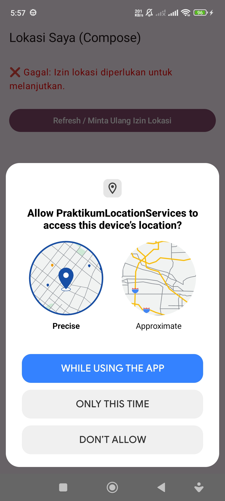
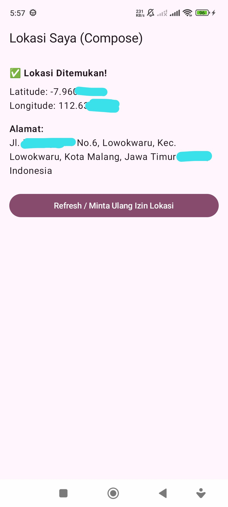
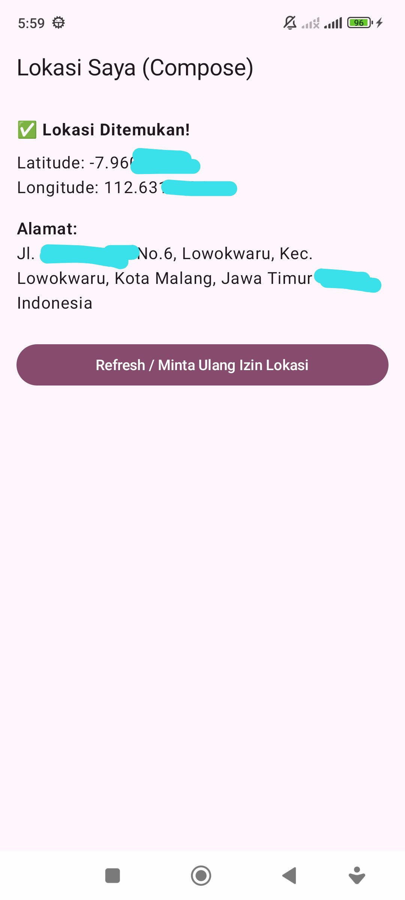
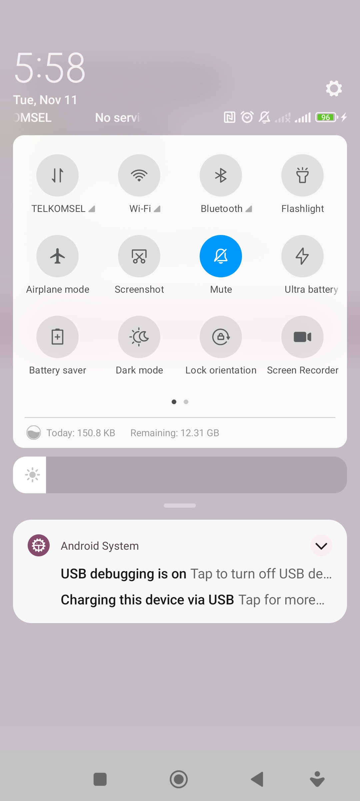

```markdown
# 📍 LocationServicesKotlin

A simple Android app built with **Kotlin** and **Jetpack Compose** to demonstrate how to access and display user location using **Google’s Fused Location Provider**.

---

## 🚀 Overview
**LocationServicesKotlin** is part of a Mobile Application Development (PAPB) practicum project.  
This app retrieves the user's current location (latitude & longitude) and converts it into a readable address using **Geocoder**.

The app also demonstrates behavior in various scenarios such as:
- When location permission is granted
- When GPS/location is turned off
- When Wi-Fi or mobile data is turned off

---

## 🛠️ Tech Stack
- **Kotlin**
- **Jetpack Compose**
- **Android ViewModel**
- **Google Play Services Location (FusedLocationProviderClient)**
- **Coroutines**
- **Geocoder API**

---

## 📱 Features
- Request location permission at runtime  
- Retrieve current latitude and longitude  
- Display corresponding address using Geocoder  
- Handle errors when GPS or location services are disabled  
- Work even when Wi-Fi or mobile data is turned off  

---

## 🧩 Project Structure
```

📦 LocationServicesKotlin
┣ 📜 MainActivity.kt
┣ 📜 LocationViewModel.kt
┣ 🖼️ TampilanAwal.jpg
┣ 🖼️ WifiOnLocationOn.jpg
┣ 🖼️ WifiOffLocationOn.jpg
┣ 🖼️ NoInternet.jpg
┣ 🖼️ LocationOff.jpg
┗ 📜 README.md

```

---

## 📸 Screenshots

### Tampilan Awal
Meminta izin lokasi dari pengguna  


### Lokasi Aktif (WiFi On)
Berhasil menampilkan koordinat dan alamat  


### Lokasi Aktif (WiFi Off)
Aplikasi tetap berjalan normal meskipun tanpa koneksi internet  


### Internet Dimatikan
Bukti bahwa Wi-Fi dan paket data benar-benar dimatikan  


### Lokasi Dimatikan
Menampilkan pesan error saat GPS dimatikan  


---

## How It Works
1. Saat aplikasi dijalankan, sistem meminta izin lokasi (`ACCESS_FINE_LOCATION`).
2. Jika disetujui, aplikasi akan mengambil data lokasi terakhir melalui `FusedLocationProviderClient`.
3. Koordinat dikonversi menjadi alamat menggunakan `Geocoder`.
4. Jika lokasi dimatikan, aplikasi menampilkan pesan error.
5. Semua operasi lokasi dijalankan secara asynchronous menggunakan `Coroutine` dan `Dispatchers.IO`.

---

## Refleksi
Aplikasi ini menunjukkan bagaimana **akses lokasi di Android** dapat bekerja secara lokal tanpa ketergantungan pada jaringan internet.  
Dengan penggunaan `suspend function` dan `Dispatchers.IO`, proses geocoding dan pengambilan lokasi dapat berjalan efisien tanpa menghambat UI.

---

## 👨‍💻 Author
**Nadhif Rif’at Rasendriya**  
_Pengembangan Aplikasi Perangkat Bergerak (PAPB) — Modul 8: Location Services_

```

